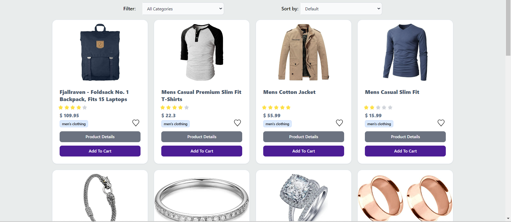
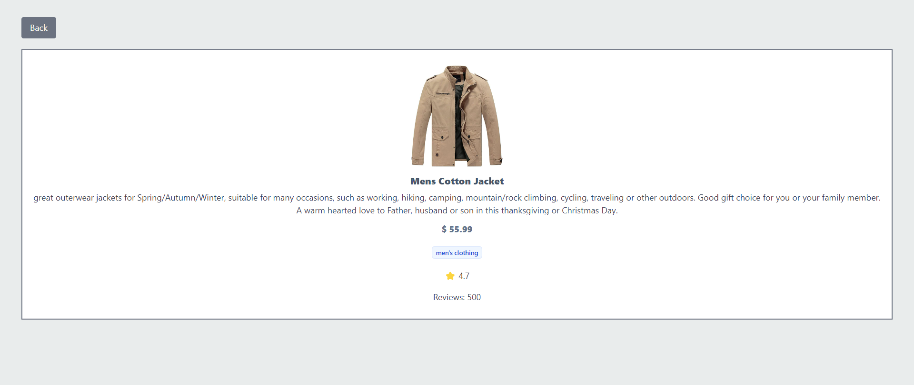

# 🏪 VUE CHALLENGE | JSF 03 👔

## 🛒 Introduction
In this project, I built an e-commerce application to test my skills with VUe. It offers a smooth browsing experience, quick loading times, and an attractive design using Vue's efficient reactivity and component-based architecture.

## 🤖 Technologies
The app is built using the following technologies:

- HTML: Structuring components and pages.
- CSS3: Styling with Tailwind CSS for a utility-first approach.
- JavaScript: Managing logic, interactions, and API requests.
- Vue.js: Framework for building the app's user interface with a reactive and component-based approach.
- Pinia: For state management, handling data such as product lists and applied filters.
- Vite: A build tool for fast development and efficient bundling.
- Fakestore API: A free API providing e-commerce product data.

## Setup Instructions 🚀
1. Clone the Repository & Open Terminal
2. Install Dependencies: `npm install`
3. Start the Development Server: npm run dev
4. View the Live App: Follow the provided link to see the application in action.

## Usage Examples 🛍️
### Home Page 🏠
Navigate to the Home page by clicking on the Logo to view a grid of available products.

### Filter by Category & Sort by Price 🔍
Use the filtering and sorting options to find products:

Filter by Category: Select a category from the "Filter" dropdown to display products from that category only.
Sort by Price: Choose an option from the "Sort by" dropdown to sort products by price (low to high, high to low, or default).

### Viewing Product Details 🛒
Click the `Product Details` button to view detailed information, including the image, title, price, category, rating, and description. A dedicated Product Detail page is provided, with a back button to return to the Home page.

